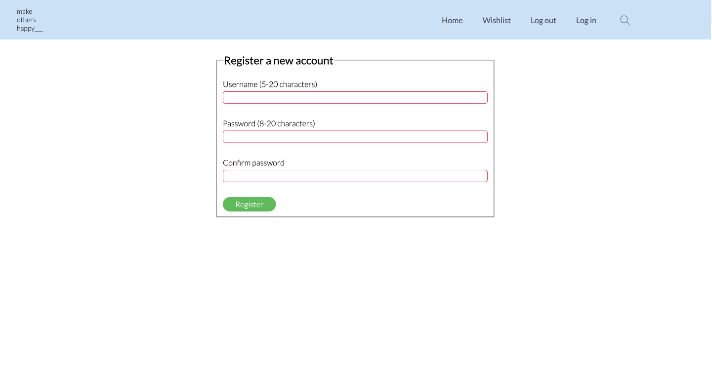
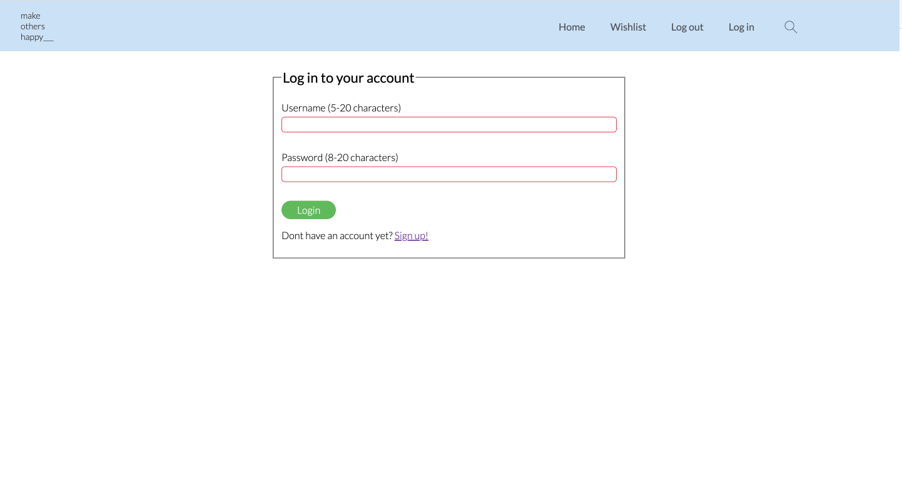
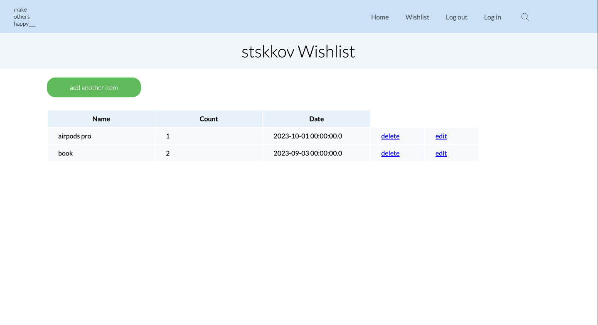
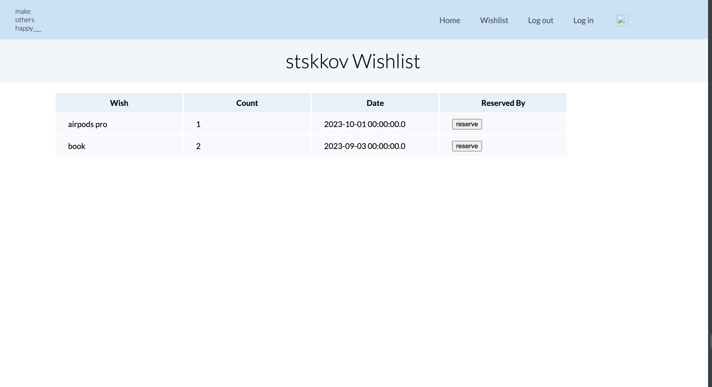

# Wishlist-project

#### This is 'Wishlist' project for Web Application class written first in php and javascript. Located in 'php' folder.  
#### Then 'Wishlist' was rewritten using java Spring framework. Located in 'java-spring' folder.

## Application contains the registration page

## Login page

## You can create, delete and edit things in your wishlist

## Also searching for other user's wishlists and reserve the thing that you want to give

